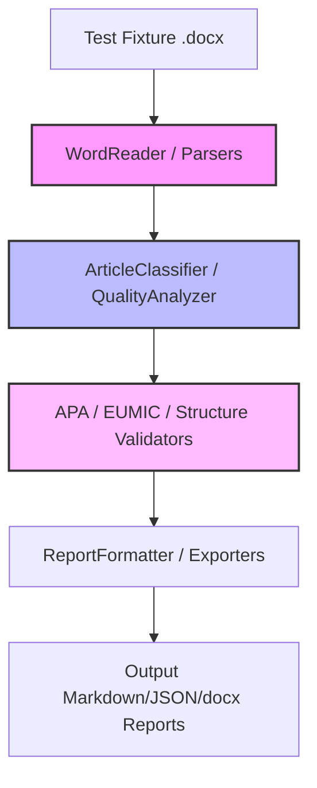

# Design: Add Unittest Suite

## Technical Approach

We implement a hybrid testing strategy using Python's standard `unittest` library:
1. **Unit Tests**: Verify core business rules, validation logic, and analyzers deterministically using in-memory mock models.
2. **Integration Tests**: Verify `.docx` readers, citation, and reference parsers using a real test fixture.
3. **E2E Tests**: Validate the CLI workflow and the Gradio UI using mock environments and Gradio's client.

All external dependencies (`win32com`, `pythoncom`, `ollama`, `language_tool_python`) are mocked to enable cross-platform execution (e.g. Linux CI) without local servers or MS Word installations.

## Architecture Decisions

### Decision: Mocking win32com and pythoncom dynamically

**Choice**: Inject mock modules into `sys.modules` and use `unittest.mock.patch` where needed.
**Alternatives considered**: Modifying production code to avoid using `win32com`.
**Rationale**: Preserves the production code's design while enabling tests to run on macOS/Linux CIs where `pywin32` is not installable.

### Decision: In-process CLI and Gradio client E2E execution

**Choice**: Run CLI in-process by mocking `sys.argv` and run Gradio via `gradio.testing.Client`.
**Alternatives considered**: Spawning full OS subprocesses and live browsers.
**Rationale**: Speeds up tests significantly, simplifies mock injection, and avoids port conflicts in CI environments.

## Data Flow



## File Changes

| File | Action | Description |
|------|--------|-------------|
| `tests/fixtures/capacidades_razonamiento_emergente_LLMs.docx` | Create | Copy from `E:\Python\silvina-doc\capacidades_razonamiento_emergente_LLMs.docx`. Used for integration tests. |
| `tests/test_apa_validator.py` | Create | Unit tests for APA style and formatting rule validations. |
| `tests/test_structure_analyzer.py` | Create | Unit tests for document layout and structure analysis. |
| `tests/test_citation_matcher.py` | Create | Unit tests for resolving citations against bibliographic references. |
| `tests/test_word_reader.py` | Create | Unit tests for `WordReader` and `WordCounter` (COM mocked). |
| `tests/test_citation_parser.py` | Create | Integration tests for docx body/footnote citation extraction. |
| `tests/test_reference_parser.py` | Create | Integration tests for XML-based reference list extraction. |
| `tests/test_content_extractor.py` | Create | Unit tests for title, author, and paragraph extraction. |
| `tests/test_article_classifier.py` | Create | Unit tests for classification logic under mock Ollama. |
| `tests/test_quality_analyzer.py` | Create | Unit tests for LLM quality analysis under mock Ollama. |
| `tests/test_gramatica_checker.py` | Create | Unit tests for `check_gramatica` with mock LanguageTool. |
| `tests/test_eumic_verifier.py` | Create | Unit tests for EUMIC compliance checklist. |
| `tests/e2e/test_cli_e2e.py` | Create | E2E CLI workflow testing using in-process invocation. |
| `tests/e2e/test_gradio_e2e.py` | Create | E2E UI testing of the Gradio interface using the Gradio test Client. |

## Interfaces / Contracts

### win32com and pythoncom Mocking

For non-Windows platforms, we mock these modules before importing components:
```python
import sys
from unittest.mock import MagicMock

sys.modules['win32com'] = MagicMock()
sys.modules['win32com.client'] = MagicMock()
sys.modules['pythoncom'] = MagicMock()
```

### Ollama Mocking

We mock the `ollama.Client` generate method to return structured responses:
```python
with patch('ollama.Client') as mock_client_cls:
    mock_client = mock_client_cls.return_value
    mock_client.generate.return_value = {
        'response': 'S4: SI\nS5: SI\nS6: SI'
    }
```

### LanguageTool Mocking

We patch `language_tool_python.LanguageTool` to avoid JVM dependency:
```python
with patch('language_tool_python.LanguageTool') as mock_tool_cls:
    mock_tool = mock_tool_cls.return_value
    mock_tool.check.return_value = [] # No errors
```

## Testing Strategy

| Layer | What to Test | Approach |
|-------|-------------|----------|
| Unit | Validation rules, classifiers, metrics | Use pure Python memory models and mock LLM/parser responses. |
| Integration | Document loading, text extraction, parsers | Read from `tests/fixtures/capacidades_razonamiento_emergente_LLMs.docx` using mocked COM. |
| CLI E2E | End-to-end report generation | Run `main.py` in-process with mocked arguments and check output files. |
| UI E2E | Gradio interface and feedback storage | Initialize Gradio app interface and test events via `gradio.testing.Client`. |

## Migration / Rollout

No migration of production code is required. The test suite runs as part of standard CI/CD tooling (`python -m unittest discover tests`).

## Open Questions

- [ ] Should we check for Java availability in `test_gramatica_checker.py` and fall back to skipping the test if not running in a mocked environment? *Decision*: Standard mocking of `language_tool_python` will prevent JVM invocation entirely, making fallback checks unnecessary.
