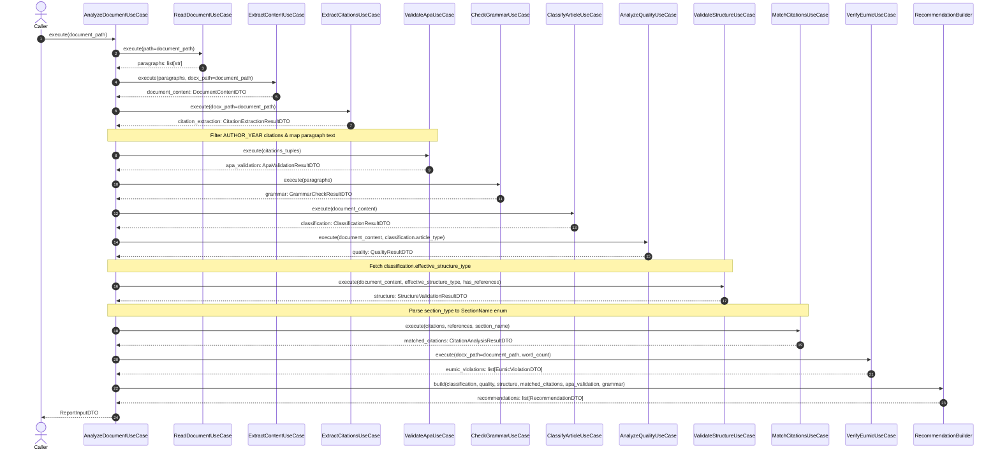

# SDD Design — analyze-document-orchestrator

## Executive Summary

Migrate and consolidate the document analysis pipeline from legacy code into a clean, hexagonal architecture orchestrator (`AnalyzeDocumentUseCase`). The orchestrator coordinates ten distinct use cases, aggregates their inputs, evaluates results against configurable threshold settings (`RecommendationSettings`) using a pure domain service (`RecommendationBuilder`), and produces a strongly-typed `ReportInputDTO` containing quality recommendations and EUMIC format compliance violations.

---

## Architecture Overview

```
src/
  domain/
    enums/
      recommendation_priority.py          <- MODIFIED: HIGH/MEDIUM/LOW only (3 members)
      publication_verdict.py              <- NEW: CRITICAL/WARNING/APPROVED verdict enum
    dtos/
      classification_result_dto.py        <- MODIFIED: Added effective_structure_type with guard clauses
      recommendation_dto.py               <- NEW: Immutable RecommendationDTO (priority + message)
      publication_verdict_dto.py          <- NEW: Immutable PublicationVerdictDTO (verdict + message)
      report_input_dto.py                 <- MODIFIED: Added recommendations, verdict, eumic_violations
    recommendation/
      __init__.py                         <- NEW: Package marker
      analysis_context.py                 <- NEW: Frozen dataclass grouping all rule inputs
      recommendation_rule.py              <- NEW: Abstract base RecommendationRule
      rules.py                            <- NEW: 7 concrete rules (Quality/Grammar/Dimension/Structure/CitationMatch/CitationCount/Confidence)
      recommendation_settings.py          <- NEW: Threshold settings (all fields required, no defaults)
      recommendation_builder.py           <- NEW: Orchestrates rules + evaluator; returns tuple
      publication_verdict_evaluator.py    <- NEW: Evaluates PublicationVerdictDTO from context
    tests/
      enums/
        test_recommendation_priority.py   <- MODIFIED: 3 members only
      recommendation/
        __init__.py                       <- NEW: Package marker
        test_recommendation_builder.py    <- NEW: Unit tests for builder, rules, verdict
  application/
    analyze_document_use_case.py          <- NEW: Pipeline orchestrator
    tests/
      test_analyze_document_use_case.py   <- NEW: Orchestrator tests with mock dependencies
  infrastructure/
    config/
      __init__.py                         <- NEW: Package marker
      recommendation_config.py            <- NEW: RecommendationConfig.build_settings() classmethod
    wirings/
      analyze_document_use_case_wiring.py <- NEW: _get_xxx() private-method pattern
    adapters/
      report/
        docx_report_adapter.py            <- MODIFIED: Verdict from report_input.verdict, not recommendations
    tests/
      test_analyze_document_use_case_wiring.py <- NEW: Wiring + env var override tests
      adapters/
        report/
          fixtures.py                     <- MODIFIED: make_report_input_dto includes verdict
```

---

## Component Interfaces

### `RecommendationPriority` — [recommendation_priority.py](file:///E:/Python/silvina-editorial/src/domain/enums/recommendation_priority.py)

Extend the existing `RecommendationPriority` enumeration with English identifiers mapped to legacy Spanish values to maintain downstream compatibility:

```python
from enum import Enum


class RecommendationPriority(Enum):
    """Priority levels for recommendations."""

    HIGH = "alta"
    MEDIUM = "media"
    LOW = "baja"
    CRITICAL = "critica"
    WARNING = "advertencia"
    APPROVED = "aprobado"
```

### `RecommendationDTO` — [recommendation_dto.py](file:///E:/Python/silvina-editorial/src/domain/dtos/recommendation_dto.py)

An immutable data transfer object to represent a single formatting or quality recommendation:

```python
from dataclasses import dataclass

from src.domain.dtos.base_dto import BaseDTO
from src.domain.enums.recommendation_priority import RecommendationPriority


@dataclass(frozen=True)
class RecommendationDTO(BaseDTO):
    """Immutable data transfer object representing an editorial recommendation."""

    priority: RecommendationPriority
    message: str
```

### `ClassificationResultDTO` IMRyD Override — [classification_result_dto.py](file:///E:/Python/silvina-editorial/src/domain/dtos/classification_result_dto.py)

Add a read-only property to evaluate the effective structure type using a case-sensitive search for the string `"IMRyD"` inside the classification reasoning when the article is classified as `CIENTIFICO`:

```python
    @property
    def effective_structure_type(self) -> ArticleType:
        """Get the effective article type for structure validation based on IMRyD reasoning."""
        if self.article_type == ArticleType.CIENTIFICO:
            if "IMRyD" in (self.reasoning or ""):
                return ArticleType.CIENTIFICO
            return ArticleType.DIVULGACION
        return self.article_type
```

### `RecommendationSettings` — [recommendation_settings.py](file:///E:/Python/silvina-editorial/src/domain/recommendation/recommendation_settings.py)

A pure domain settings dataclass initialized with sensible default values:

```python
from dataclasses import dataclass

from src.domain.dtos.base_dto import BaseDTO


@dataclass(frozen=True)
class RecommendationSettings(BaseDTO):
    """Configuration settings for generating quality and formatting recommendations."""

    publish_threshold: float = 7.0
    quality_threshold: float = 7.0
    grammar_threshold: float = 7.0
    dimension_threshold: float = 6.0
    citation_match_threshold: float = 90.0
    critical_citation_match_threshold: float = 50.0
    citation_count_threshold: int = 10
    classification_confidence_threshold: float = 0.7
```

### `RecommendationBuilder` — [recommendation_builder.py](file:///E:/Python/silvina-editorial/src/domain/recommendation/recommendation_builder.py)

A pure domain service that takes analysis outputs and generates formatting or publication recommendations:

```python
from src.domain.dtos.apa_validation_result_dto import ApaValidationResultDTO
from src.domain.dtos.citation_analysis_result_dto import CitationAnalysisResultDTO
from src.domain.dtos.classification_result_dto import ClassificationResultDTO
from src.domain.dtos.grammar_check_result_dto import GrammarCheckResultDTO
from src.domain.dtos.quality_result_dto import QualityResultDTO
from src.domain.dtos.recommendation_dto import RecommendationDTO
from src.domain.dtos.structure_validation_result_dto import StructureValidationResultDTO
from src.domain.enums.recommendation_priority import RecommendationPriority
from src.domain.recommendation.recommendation_settings import RecommendationSettings


class RecommendationBuilder:
    """Domain service for generating editorial and publishing recommendations."""

    def __init__(self, settings: RecommendationSettings) -> None:
        self._settings = settings

    def build(
        self,
        classification: ClassificationResultDTO,
        quality: QualityResultDTO,
        structure: StructureValidationResultDTO,
        citations: CitationAnalysisResultDTO,
        apa_validation: ApaValidationResultDTO,
        grammar: GrammarCheckResultDTO,
    ) -> list[RecommendationDTO]:
        """Evaluate document metrics and return a list of recommendations."""
        ...
```

#### Detailed recommendation rules inside `build()`:
1. **Quality Check**:
   - If `quality.overall_score < self._settings.quality_threshold`: Append `RecommendationDTO(priority=RecommendationPriority.HIGH, message=f"La calidad semántica ({quality.overall_score:.1f}/10) necesita mejorar. Revise las dimensiones con puntuación baja.")`
2. **Grammar Check**:
   - If `grammar.score < self._settings.grammar_threshold`: Append `RecommendationDTO(priority=RecommendationPriority.HIGH, message=f"Gramática ({grammar.score:.1f}/10) requiere corrección.")`
3. **Dimension Score Check**:
   - Iterating over `quality.dimension_scores.items()`: If `score < self._settings.dimension_threshold`, append `RecommendationDTO(priority=RecommendationPriority.MEDIUM, message=f'Dimensión "{dimension_name}" tiene puntuación baja ({score:.1f}). {feedback}')`
4. **Structure Check**:
   - If `structure.is_valid` is `False`: For each `missing_section` in `structure.missing_sections`, append `RecommendationDTO(priority=RecommendationPriority.HIGH, message=f'Falta la sección requerida: "{missing_section}". Complete esta sección según las normas EUMIC.')`
5. **Citations Match Rate**:
   - `match_rate = (citations.matched_count / citations.total_citations * 100.0) if citations.total_citations > 0 else 100.0`
   - `unmatched_string = "; ".join(citations.unmatched_citations[:10])`
   - If `match_rate < self._settings.citation_match_threshold`: Append `RecommendationDTO(priority=RecommendationPriority.HIGH, message=f"Tasa de coincidencia de citas baja ({match_rate:.1f}%). {citations.unmatched_count} citas no tienen referencia correspondiente. Citas sin referencia: {unmatched_string}")`
   - Else if `citations.unmatched_count > 0`: Append `RecommendationDTO(priority=RecommendationPriority.MEDIUM, message=f"{citations.unmatched_count} citas no tienen referencia correspondiente. Citas sin referencia: {unmatched_string}")`
   - If `citations.total_citations < self._settings.citation_count_threshold`: Append `RecommendationDTO(priority=RecommendationPriority.MEDIUM, message=f"Número bajo de citas ({citations.total_citations}). Considere ampliar el marco teórico con más referencias.")`
6. **Classification Confidence**:
   - If `classification.confidence` is not `None` and `classification.confidence < self._settings.classification_confidence_threshold`: Append `RecommendationDTO(priority=RecommendationPriority.LOW, message=f"La clasificación tiene confianza baja ({classification.confidence:.1%}). Verifique que el documento siga la estructura típica de su categoría.")`
7. **Final Publication Recommendation**:
   - Determine `has_critical_issues` (`True` if `quality.overall_score < 5.0` or `grammar.score < 5.0` or `structure.is_valid is False` or `match_rate < self._settings.critical_citation_match_threshold`)
   - Determine `has_warnings` (`True` if `quality.overall_score < self._settings.publish_threshold` or `grammar.score < self._settings.publish_threshold` or `match_rate < self._settings.citation_match_threshold` or `len(apa_validation.violations) > 0`)
   - Decision Tree:
     - If `has_critical_issues`: Priority `CRITICAL`, message `"❌ NO APTO PARA PUBLICACIÓN. El documento presenta errores críticos que deben corregirse."`
     - Else if `citations.total_citations == 0`: Priority `CRITICAL`, message `"❌ NO APTO PARA PUBLICACIÓN. No se detectaron citas APA en el texto. Verifique el formato de citación según normas APA 7."`
     - Else if `has_warnings`: Priority `WARNING`, message `"⚠️ REQUIERE REVISIÓN antes de publicación. Corrija los problemas identificados."`
     - Otherwise: Priority `APPROVED`, message `"✅ APTO PARA PUBLICACIÓN. El documento cumple con los estándares de calidad."`

### `ReportInputDTO` — [report_input_dto.py](file:///E:/Python/silvina-editorial/src/domain/dtos/report_input_dto.py)

Modify the existing `ReportInputDTO` to strongly type the recommendations list and add EUMIC validation results:

```python
from dataclasses import dataclass

from src.domain.dtos.apa_validation_result_dto import ApaValidationResultDTO
from src.domain.dtos.base_dto import BaseDTO
from src.domain.dtos.citation_analysis_result_dto import CitationAnalysisResultDTO
from src.domain.dtos.classification_result_dto import ClassificationResultDTO
from src.domain.dtos.document_content_dto import DocumentContentDTO
from src.domain.dtos.eumic_violation_dto import EumicViolationDTO
from src.domain.dtos.grammar_check_result_dto import GrammarCheckResultDTO
from src.domain.dtos.quality_result_dto import QualityResultDTO
from src.domain.dtos.recommendation_dto import RecommendationDTO
from src.domain.dtos.structure_validation_result_dto import StructureValidationResultDTO


@dataclass(frozen=True)
class ReportInputDTO(BaseDTO):
    """Aggregates all analysis results required to generate an export report."""

    filename: str
    document_content: DocumentContentDTO
    classification: ClassificationResultDTO
    quality: QualityResultDTO
    grammar: GrammarCheckResultDTO
    structure: StructureValidationResultDTO
    citations: CitationAnalysisResultDTO
    apa_validation: ApaValidationResultDTO
    recommendations: list[RecommendationDTO]
    eumic_violations: list[EumicViolationDTO]
```

### `AnalyzeDocumentUseCase` — [analyze_document_use_case.py](file:///E:/Python/silvina-editorial/src/application/analyze_document_use_case.py)

Implement the top-level orchestrator class to execute the complete document analysis pipeline sequentially:

```python
from src.application.analyze_quality_use_case import AnalyzeQualityUseCase
from src.application.check_grammar_use_case import CheckGrammarUseCase
from src.application.classify_article_use_case import ClassifyArticleUseCase
from src.application.extract_citations_use_case import ExtractCitationsUseCase
from src.application.extract_content_use_case import ExtractContentUseCase
from src.application.match_citations_use_case import MatchCitationsUseCase
from src.application.read_document_use_case import ReadDocumentUseCase
from src.application.validate_apa_use_case import ValidateApaUseCase
from src.application.validate_structure_use_case import ValidateStructureUseCase
from src.application.verify_eumic_use_case import VerifyEumicUseCase
from src.domain.dtos.report_input_dto import ReportInputDTO
from src.domain.exceptions.decorators.generic_error_handler import generic_error_handler
from src.domain.recommendation.recommendation_builder import RecommendationBuilder


class AnalyzeDocumentUseCase:
    """Orchestrator coordinating all document analysis use cases."""

    def __init__(
        self,
        read_document_use_case: ReadDocumentUseCase,
        extract_content_use_case: ExtractContentUseCase,
        extract_citations_use_case: ExtractCitationsUseCase,
        validate_apa_use_case: ValidateApaUseCase,
        check_grammar_use_case: CheckGrammarUseCase,
        classify_article_use_case: ClassifyArticleUseCase,
        analyze_quality_use_case: AnalyzeQualityUseCase,
        validate_structure_use_case: ValidateStructureUseCase,
        match_citations_use_case: MatchCitationsUseCase,
        verify_eumic_use_case: VerifyEumicUseCase,
        recommendation_builder: RecommendationBuilder,
    ) -> None:
        self._read_document_use_case = read_document_use_case
        self._extract_content_use_case = extract_content_use_case
        self._extract_citations_use_case = extract_citations_use_case
        self._validate_apa_use_case = validate_apa_use_case
        self._check_grammar_use_case = check_grammar_use_case
        self._classify_article_use_case = classify_article_use_case
        self._analyze_quality_use_case = analyze_quality_use_case
        self._validate_structure_use_case = validate_structure_use_case
        self._match_citations_use_case = match_citations_use_case
        self._verify_eumic_use_case = verify_eumic_use_case
        self._recommendation_builder = recommendation_builder

    @generic_error_handler
    def execute(self, document_path: str) -> ReportInputDTO:
        """Run the complete document analysis pipeline and return aggregated results."""
        ...
```

---

## Data Flow

The following sequence details how the orchestrator processes inputs through the analysis pipeline:



---

## Architectural Decisions

### ADR-1: Location of IMRyD Override Logic on `ClassificationResultDTO`

- **Decision**: Implement the override behavior as a read-only property (`effective_structure_type`) on the `ClassificationResultDTO` domain class.
- **Rationale**: Keeps the `AnalyzeDocumentUseCase` orchestrator clean and focused on workflow coordination rather than low-level string checking. It ensures cohesive object design (domain policy encapsulated within the DTO representing classification output).
- **Rejected**: Hardcoding string match checks directly within `AnalyzeDocumentUseCase.execute()`. This would pollute the application pipeline orchestrator with domain-specific article rules, violating SOLID single-responsibility boundaries.

### ADR-2: Encapsulation of Thresholds in `RecommendationSettings`

- **Decision**: Create a pure, frozen domain DTO `RecommendationSettings` containing all threshold thresholds. Read values from `os.environ` only inside `AnalyzeDocumentUseCaseWiring` and inject the instantiated settings DTO into `RecommendationBuilder`.
- **Rationale**: Prevents environment side-effects (`os.getenv`) from leaking into domain services and application-layer use cases. This makes both `RecommendationBuilder` and `AnalyzeDocumentUseCase` purely testable without mocking environment variables or system-level modules.
- **Rejected**: Accessing `os.getenv()` directly within `RecommendationBuilder.build()`. This introduces hidden external dependencies that make pure unit testing complex.

### ADR-3: Split RecommendationPriority and PublicationVerdict into Separate Enums

- **Decision**: Keep `RecommendationPriority` with only `HIGH/MEDIUM/LOW`. Create a separate `PublicationVerdict` enum with `CRITICAL/WARNING/APPROVED`. `RecommendationBuilder.build()` returns `tuple[list[RecommendationDTO], PublicationVerdictDTO]`.
- **Rationale**: A publication verdict (`CRITICAL/WARNING/APPROVED`) is semantically different from a specific editorial recommendation priority (`HIGH/MEDIUM/LOW`). Mixing them in a single enum conflated two unrelated concepts and forced filtering logic to distinguish "final" recommendations from specific ones.
- **Rejected**: Adding `CRITICAL`, `WARNING`, `APPROVED` to `RecommendationPriority` (original Slice 13 design). This was implemented first but reverted during integration review — the enum became a union of incompatible concepts.

### ADR-3b: Rule Pattern for RecommendationBuilder

- **Decision**: Replace the inline `if/elif` chain in `RecommendationBuilder.build()` with injectable `RecommendationRule` implementations. Each rule is an independent class with a single `evaluate(context: AnalysisContext) -> list[RecommendationDTO]` method.
- **Rationale**: Seven inline conditionals in a single method made individual rule testing difficult and added friction to future rule additions. The Rule pattern gives each rule its own class, test, and responsibility boundary.
- **Rejected**: Keeping the inline `if/elif` chain (original Slice 13 implementation). Workable for 7 rules but does not scale and makes tests co-dependent.

### ADR-3c: RecommendationConfig as Infrastructure Config Class

- **Decision**: `RecommendationConfig` lives in `src/infrastructure/config/` and exposes `build_settings()` as a classmethod that reads `os.getenv` **at call time**. `RecommendationSettings` has no default values.
- **Rationale**: Reading env vars at class-attribute definition time (module import) makes `patch.dict(os.environ, ...)` in tests ineffective because the module is already loaded. A classmethod defers env reads to the moment the wiring creates the settings object, making override tests reliable.
- **Rejected**: Class-level attributes on `RecommendationConfig` (e.g. `QUALITY_THRESHOLD = float(os.getenv(...))`). Tested and confirmed broken for env-var-override tests.

### ADR-4: Safe EUMIC Violation Validation Execution

- **Decision**: Run EUMIC validation via `VerifyEumicUseCase`, catch/re-raise via `@generic_error_handler`, and append violations to `ReportInputDTO`. No fatal exception is raised on validation failure.
- **Rationale**: EUMIC standards are layout guidelines. Their violations must be reported to the editor for formatting adjustments without halting the semantic analysis pipeline, matching legacy requirements.
- **Rejected**: Raising a fatal exception or error when EUMIC violations are found. This would prevent the user from receiving grammar, citations, and semantic reviews.

### ADR-5: Citation Filtering and Tuple Generation for APA Validation

- **Decision**: Within `AnalyzeDocumentUseCase.execute()`, filter the extracted citations list by checking `citation.citation_type == CitationType.AUTHOR_YEAR` first. Then, construct tuples of `(citation.text, citation.location, paragraph_text)` where `paragraph_text` is safely retrieved using `paragraphs[citation.location]`.
- **Rationale**: Isolates validation to relevant citation styles and enriches the validation input with paragraph context required by the `ValidateApaUseCase` validator.
- **Rejected**: Passing all citation types indiscriminately to `ValidateApaUseCase`. Non-APA formats would generate false validation errors.

---

## Integration Points

- **Inputs**:
  - `document_path: str` - Path to the `.docx` document to process.
- **Outputs**:
  - `ReportInputDTO` containing:
    - `document_content: DocumentContentDTO`
    - `classification: ClassificationResultDTO`
    - `quality: QualityResultDTO`
    - `grammar: GrammarCheckResultDTO`
    - `structure: StructureValidationResultDTO`
    - `citations: CitationAnalysisResultDTO`
    - `apa_validation: ApaValidationResultDTO`
    - `recommendations: list[RecommendationDTO]`
    - `eumic_violations: list[EumicViolationDTO]`
- **External Interfaces**:
  - `DocxReportAdapter` - Refactored to utilize attribute access syntax (`recommendation.priority` and `recommendation.message`) instead of dictionary subscript key access.

---

## Testing Strategy

### Unit Tests
1. **`TestRecommendationPriority`** (in [test_recommendation_priority.py](file:///E:/Python/silvina-editorial/src/domain/tests/enums/test_recommendation_priority.py)):
   - Assert all 6 enum keys exist.
   - Assert they map to exact Spanish string values.
2. **`TestClassificationResultDTO`**:
   - Verify `effective_structure_type` property returns `ArticleType.CIENTIFICO` when article type is scientific and reasoning contains `"IMRyD"`.
   - Verify it returns `ArticleType.DIVULGACION` when article type is scientific but reasoning does not contain `"IMRyD"`.
   - Verify other article types are returned unchanged.
3. **`TestRecommendationBuilder`** (in [test_recommendation_builder.py](file:///E:/Python/silvina-editorial/src/domain/tests/recommendation/test_recommendation_builder.py)):
   - Test default settings initialization.
   - Test `build()` under an "Apto para publicación" scenario (returns `RecommendationPriority.APPROVED`).
   - Test `build()` with grammar or quality score below thresholds (returns correct recommendations and priorities).
   - Test `build()` with critical issues (returns `RecommendationPriority.CRITICAL`).

### Integration Tests
1. **`TestAnalyzeDocumentUseCase`** (in [test_analyze_document_use_case.py](file:///E:/Python/silvina-editorial/src/application/tests/test_analyze_document_use_case.py)):
   - Execute the orchestrator using mock sub-use cases to verify sequential calls are executed correctly.
   - Verify correct mapping of paragraphs for citation location index bounds checking.
   - Verify that only `AUTHOR_YEAR` citations are forwarded to `ValidateApaUseCase`.
   - Verify EUMIC violations are correctly integrated into the output `ReportInputDTO`.

### Wiring Verification Tests
1. **`TestAnalyzeDocumentUseCaseWiring`** (in [test_analyze_document_use_case_wiring.py](file:///E:/Python/silvina-editorial/src/infrastructure/tests/test_analyze_document_use_case_wiring.py)):
   - Test successful factory execution using `create_use_case()`.
   - Assert environment variable values are loaded and default values are fallback populated correctly.
