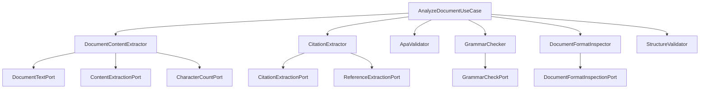

# Design: Decouple Use Case Ports

## Technical Approach
We will decouple `AnalyzeDocumentUseCase` from its direct infrastructure ports by creating four focused domain services (`DocumentContentExtractor`, `CitationExtractor`, `DocumentFormatInspector`, `GrammarChecker`). Additionally, we relocate logic for empty checks, paragraph lookups, type filtering, and section exclusions from the orchestrator into `ApaValidator` and `StructureValidator`, keeping the application layer slim and orchestrator-focused.

## Architecture Decisions

| Decision | Option | Tradeoff | Decision |
|---|---|---|---|
| **APA Citation Logic** | Move filtering and preview lookup to `ApaValidator.validate_all_citations`. | Enriches validator responsibility but eliminates leaked paragraph-indexing logic from use case. | **Approved** |
| **Structure Logic** | Move empty check and development/references section filtering to `StructureValidator.validate_structure`. | Keeps validator stateless but encapsulates structural rules within the domain layer. | **Approved** |
| **Service Granularity** | Create 4 distinct domain services for text extraction, citation extraction, formatting, and grammar. | Increases file count but strictly enforces Single Responsibility Principle (SRP). | **Approved** |

## Data Flow
The orchestration pipeline processes documents sequentially:


## File Changes

| File | Action | Description |
|---|---|---|
| `src/domain/document/document_content_extractor.py` | Create | Wraps text/content ports. Loads paragraphs, extracts content, and replaces counts if character count port succeeds. |
| `src/domain/citation/citation_extractor.py` | Create | Wraps citation/reference ports to extract citations and references. |
| `src/domain/document/document_format_inspector.py` | Create | Wraps format inspection port. |
| `src/domain/grammar/grammar_checker.py` | Create | Wraps grammar check port and maps score/feedback via `GrammarScoreLevel`. |
| `src/domain/citation/apa_validator.py` | Modify | Update `validate_all_citations(citations: list[CitationDTO], paragraphs: list[str])` to filter by `AUTHOR_YEAR` and look up paragraph text (with out-of-bounds safety). |
| `src/domain/structure/structure_validator.py` | Modify | Implement `validate_structure(document_content, article_type, has_references)` with empty check and post-filtering logic. |
| `src/application/analyze_document_use_case.py` | Modify | Inject 10 domain services, remove direct ports, simplify pipeline flow. |
| `src/infrastructure/wirings/analyze_document_use_case_wiring.py` | Modify | Update composition root to instantiate and wire the 10 domain services. |
| `src/application/tests/test_analyze_document_use_case.py` | Modify | Mock new domain services and verify orchestrator invokes them. |
| `src/infrastructure/tests/test_analyze_document_use_case_wiring.py` | Modify | Verify all services are correctly resolved and wired. |

## Interfaces / Contracts

```python
# src/domain/document/document_content_extractor.py
class DocumentContentExtractor:
    def __init__(self, document_text_port: DocumentTextPort, content_extraction_port: ContentExtractionPort, character_count_port: CharacterCountPort): ...
    def extract_content(self, docx_path: str) -> DocumentContentDTO: ...

# src/domain/citation/citation_extractor.py
class CitationExtractor:
    def __init__(self, citation_extraction_port: CitationExtractionPort, reference_extraction_port: ReferenceExtractionPort): ...
    def extract_citations_and_references(self, docx_path: str) -> tuple[list[CitationDTO], list[ReferenceDTO], str]: ...

# src/domain/document/document_format_inspector.py
class DocumentFormatInspector:
    def __init__(self, document_format_inspection_port: DocumentFormatInspectionPort): ...
    def inspect(self, docx_path: str, word_count: int) -> list[EumicViolationDTO]: ...

# src/domain/grammar/grammar_checker.py
class GrammarChecker:
    def __init__(self, grammar_check_port: GrammarCheckPort): ...
    def check_grammar(self, paragraphs: list[str]) -> GrammarCheckResultDTO: ...

# src/domain/citation/apa_validator.py (modified)
class ApaValidator:
    def validate_all_citations(self, citations: list[CitationDTO], paragraphs: list[str]) -> list[ApaViolationDTO]: ...

# src/domain/structure/structure_validator.py (modified)
class StructureValidator:
    def validate_structure(self, document_content: DocumentContentDTO, article_type: ArticleType, has_references: bool) -> StructureValidationResultDTO: ...
```

## Testing Strategy

| Layer | What to Test | Approach |
|---|---|---|
| Unit | New Domain Services | Verify adapter interactions, fallback paths, and DTO mappings via mocks. |
| Unit | Validators | Test edge cases (out of bounds paragraph index for citations, empty text raising `DocumentEmpty`, section exclusions). |
| Unit | Use Case | Mock the 10 domain services and assert sequential execution in `execute`. |
| Integration | Wiring | Test instantiation of the full dependency graph and env-var overrides. |

## Migration / Rollout
No migration required.
